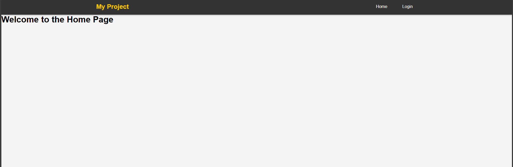
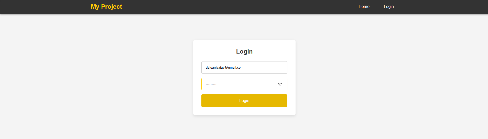
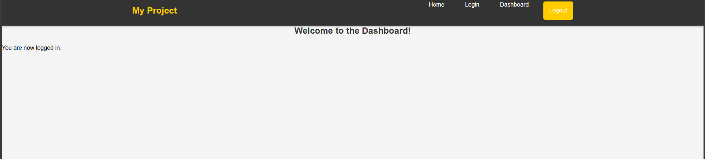

Here's an updated version of your project README with enhancements for clarity, structure, and professionalism. Feel free to modify it further if necessary:

````markdown
# React Authentication with Custom Hook and Advanced CSS

This project demonstrates how to implement authentication in a React application using a custom hook. It features advanced CSS styling to enhance the user interface, including a responsive navigation bar and protected routes that ensure only authenticated users can access certain pages.

## Features

- **Custom React Hook**: Implements an authentication context to manage user authentication state.
- **Protected Routes**: Ensures that only authenticated users can access specific routes, redirecting unauthorized users to the login page.
- **Advanced CSS Styling**: Applies modern CSS techniques for a visually appealing layout, including gradients, transitions, and hover effects.
- **Responsive Design**: Utilizes Flexbox to create a responsive navigation bar that adapts to different screen sizes.

## Technologies Used

- **React**: A JavaScript library for building user interfaces.
- **React Router**: For routing and navigation between pages.
- **CSS**: Advanced styling techniques for a modern look and feel.

## Setup Instructions

1. **Clone the repository**

   ```bash
   git clone https://github.com/yourusername/react-authentication-advanced-css.git
   ```
````

2. **Navigate into the project directory**

   ```bash
   cd react-authentication-advanced-css
   ```

3. **Install the required dependencies**

   ```bash
   npm install
   ```

4. **Start the application**

   ```bash
   npm start
   ```

5. **Open your browser and go to** `http://localhost:3000` to see the app in action.

## How It Works

### AuthContext and useAuth Hook

- The `AuthContext` manages the authentication state of the application.
- The `useAuth` hook provides access to the authentication state and functions to update it.

### ProtectedRoute Component

- The `ProtectedRoute` component checks if the user is authenticated. If not, it redirects them to the login page.

### Component Behavior

- Users must log in with specific credentials (e.g., **Email**: `dalsaniyaja@gmail.com`, **Password**: `123456789`) to access the dashboard.
- Unauthorized access to the dashboard will redirect users back to the login page.

### CSS Features

- The navigation bar is styled for a modern look, with hover effects and transitions for smooth user interaction.
- Responsive design ensures the navigation bar adapts to various screen sizes, providing an optimal viewing experience on both desktop and mobile devices.

## Screenshots

_User Dashboard_

_Login Page_

_Dashboard_


## Instructions for Customization

1. **Update the Repository URL**: Replace `https://github.com/yourusername/react-authentication-advanced-css.git` with your actual GitHub repository link.
2. **Screenshots**: Replace the placeholders (`image.png`, `image-1.png`) with relevant screenshots of your application to visually showcase its features.
3. **Customization**: Feel free to modify any section to better reflect your project or its functionality, including adding any additional features you implement in the future.

---
